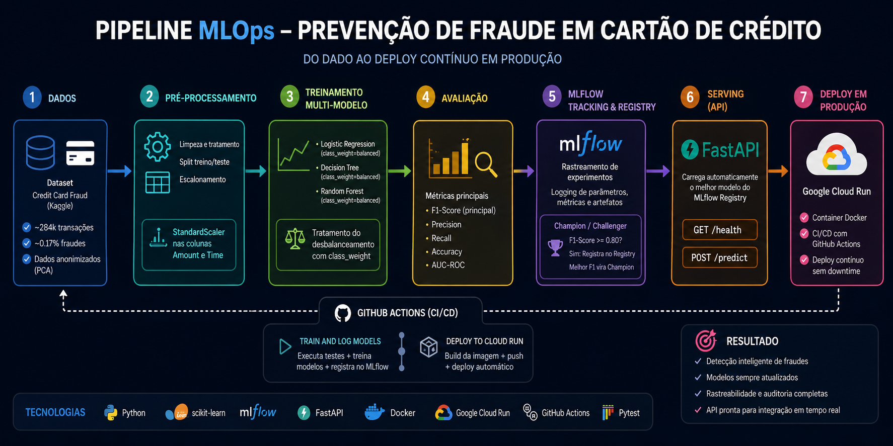

# Prevenção de Fraude em Cartão de Crédito — MLOps End-to-End

> Pipeline completo de Machine Learning com rastreamento de experimentos, registro de modelos, testes automatizados e deploy contínuo em produção na nuvem (Google Cloud).

---

## 📌 Sobre o Projeto

Este projeto implementa uma solução **end-to-end de MLOps** para detecção de fraudes em transações de cartão de crédito. O objetivo vai além de simplesmente treinar um modelo: o foco está em construir uma **infraestrutura de ML robusta e reproduzível**, cobrindo desde a ingestão de dados até o deploy automatizado de uma API de predição em produção.

O dataset utilizado é o clássico [Credit Card Fraud Detection](https://www.kaggle.com/datasets/mlg-ulb/creditcardfraud) do Kaggle, que contém transações reais anonimizadas por PCA, com forte desbalanceamento de classes (fraudes representam ~0.17% das transações).

---

## 🎯 Problema & Solução

### O Problema

Fraudes em cartões de crédito representam um prejuízo de **bilhões de dólares por ano** para instituições financeiras e consumidores ao redor do mundo. Para as empresas, o impacto vai além do financeiro:

- **Prejuízo direto**: cada transação fraudulenta não detectada gera chargeback, reembolso ao cliente e absorção do custo pela instituição.
- **Perda de confiança**: falsos negativos (fraudes não detectadas) comprometem a segurança percebida pelo cliente e podem levar ao abandono do produto.
- **Fricção desnecessária**: falsos positivos (transações legítimas bloqueadas) frustram clientes e geram custos operacionais com atendimento.
- **Velocidade de resposta**: fraudes acontecem em segundos. Uma solução que demora horas para ser atualizada ou que exige intervenção manual para ser redeploya-da não acompanha o ritmo do problema.

O desafio central é **detectar o máximo de fraudes possível sem prejudicar a experiência de clientes legítimos** — e fazer isso de forma confiável, escalável e continuamente atualizada.

---

### A Solução

Este projeto propõe uma solução de ponta a ponta que endereça tanto a **detecção** quanto a **operação contínua** do sistema:

- **Detecção inteligente**: modelos treinados para priorizar a identificação de fraudes, minimizando tanto as fraudes que passam despercebidas quanto os bloqueios indevidos de clientes legítimos.
- **Comparação sistemática de modelos**: múltiplos algoritmos são treinados, avaliados e comparados automaticamente a cada ciclo — garantindo que o modelo em produção seja sempre o mais eficaz disponível.
- **Atualização sem interrupção**: o pipeline de CI/CD garante que um novo modelo, assim que validado, seja colocado em produção automaticamente — sem parada de serviço e sem intervenção manual.
- **Rastreabilidade total**: cada decisão do modelo é ligada a um experimento registrado, com métricas e parâmetros versionados, garantindo auditoria e conformidade.
- **API pronta para integração**: a predição é exposta via API REST, podendo ser consumida em tempo real por qualquer sistema da instituição — aplicativo, gateway de pagamento ou plataforma antifraude.

---

## 🏗️ Pipeline



---

## ✨ Funcionalidades

- **Treinamento multi-modelo**: Logistic Regression, Decision Tree e Random Forest treinados e comparados em um único pipeline automatizado.
- **Rastreamento de experimentos com MLflow**: Todos os parâmetros, métricas e artefatos de cada run são logados e versionados.
- **Registro de modelos com estratégia Champion/Challenger**: Apenas modelos que superam o threshold mínimo de F1-Score são registrados. O melhor modelo vira `champion`; os demais recebem o alias `challenger`.
- **Serving via FastAPI**: API REST que carrega dinamicamente o melhor modelo registrado no MLflow ao iniciar e expõe endpoints de health-check e predição.
- **Conteinerização com Docker**: A API é empacotada em uma imagem Docker leve (`python:3.12-slim`) para garantir portabilidade e reprodutibilidade.
- **CI/CD com GitHub Actions**: Dois workflows encadeados — um para treinar e logar os modelos, outro para construir a imagem e fazer deploy automático no **Google Cloud Run** — são disparados a cada push na branch principal.
- **Testes automatizados com Pytest**: Suíte de testes unitários e de validação de dados garante a integridade do código antes de qualquer deploy.

---

## 🗂️ Estrutura do Projeto

```
Prevencao-Fraude-Cartao-Credito-MLOps/
│
├── .github/
│   └── workflows/
│       ├── train.yaml          # CI: treina e registra modelos no MLflow
│       └── deploy.yaml         # CD: builda imagem e deploya no Cloud Run
│
├── notebooks/
│   └── Detecção_de_Fraude_...ipynb  # Análise exploratória e prototipação
│
├── scripts/
│   └── train.py               # Entrypoint de treinamento
│
├── src/
│   ├── data_processing.py     # Carga, split e pré-processamento dos dados
│   ├── model_training.py      # Função de treino do modelo
│   ├── model_evaluation.py    # Cálculo de métricas (F1, Accuracy, Recall, Precision, AUC-ROC)
│   ├── pipeline.py            # Orquestração: treino + MLflow + Champion/Challenger
│   └── predict.py             # Seleção e carregamento do melhor modelo do registry
│
├── tests/
│   ├── test_data.py           # Testes de carga e estrutura de dados
│   ├── test_data_validation.py # Testes de validação do schema dos dados
│   └── test_model.py          # Testes unitários de treino e avaliação
│
├── Dockerfile                 # Imagem Docker da API de serving
├── main_api.py                # Aplicação FastAPI (health-check + /predict)
└── requirements.txt           # Dependências do projeto
```

---

## 🤖 Modelos Treinados

| Modelo | Estratégia de Balanceamento | Métrica Principal |
|---|---|---|
| Logistic Regression | `class_weight=balanced` | F1-Score |
| Decision Tree | `class_weight=balanced` | F1-Score |
| Random Forest | `class_weight=balanced` | F1-Score |

O desbalanceamento de classes (~492 fraudes em 284.807 transações) é tratado com `class_weight='balanced'` nos classificadores, ajustando automaticamente os pesos de cada classe durante o treino.

O pré-processamento aplica **StandardScaler** nas colunas `Amount` e `Time`, mantendo as demais features PCA intactas via `ColumnTransformer`.

---

## 🔄 Estratégia Champion / Challenger

```
Novo modelo treinado
        │
        ▼
F1-Score >= 0.80?
    │         │
   Não        Sim
    │          │
    ▼          ▼
 Apenas     Registrar no MLflow Registry
 Tracked         │
            Existe um Champion?
               │         │
              Não         Sim
               │           │
               ▼           ▼
         Vira Champion  Novo F1 > Champion F1?
                              │         │
                             Sim        Não
                              │          │
                              ▼          ▼
                        Novo Champion  Vira Challenger
```

Ao iniciar, a API consulta o Model Registry e carrega automaticamente o modelo com o maior F1-Score entre todos os registrados.

---

## 🚀 API de Predição

A API é construída com **FastAPI** e expõe dois endpoints:

### `GET /health`
Verifica se a API está no ar.

```json
{ "status": "ok", "message": "API está viva!" }
```

### `POST /predict`
Recebe os dados de uma transação e retorna a predição.

**Request body:** JSON com as features da transação (colunas `V1`–`V28`, `Amount`, `Time`).

**Response:**
```json
{
  "predict": 0,
  "proba_fraude": 0.032,
  "model_info": {
    "name": "RandomForest",
    "f1_score": 0.9123
  }
}
```

---

## ⚙️ CI/CD — GitHub Actions

O deploy é totalmente automatizado por dois workflows encadeados:

```
Push na main
     │
     ▼
[Train and Log Models]
  ↳ Instala dependências
  ↳ Executa scripts/train.py
  ↳ Loga experimentos + registra modelos no MLflow (GCP)
     │
     ▼ (ao concluir com sucesso)
[Deploy to Cloud Run]
  ↳ Autentica no Google Cloud
  ↳ Builda imagem Docker
  ↳ Push para Artifact Registry
  ↳ Deploy no Cloud Run (região: southamerica-east1)
```

---

## 🧪 Testes

Os testes são executados automaticamente no workflow de CI antes do deploy.

| Arquivo | Cobertura |
|---|---|
| `test_data.py` | Valida carga e estrutura do DataFrame |
| `test_data_validation.py` | Valida schema e tipos das colunas |
| `test_model.py` | Testa `train_model` e `evaluate_model` com dados sintéticos |

---

## 🛠️ Tecnologias Utilizadas

| Categoria | Tecnologia |
|---|---|
| Linguagem | Python |
| ML | Scikit-learn, Imbalanced-learn |
| Experiment Tracking | MLflow |
| API | FastAPI + Uvicorn |
| Conteinerização | Docker |
| Cloud | Google Cloud Run, Artifact Registry |
| CI/CD | GitHub Actions |
| Testes | Pytest |

---

## 📓 Notebooks

A análise exploratória e prototipação dos modelos está documentada no notebook disponível em `notebooks/`. Acesse a documentação detalhada do notebook [aqui](notebooks/README.md).

---

<p align="center">
  Feito por <strong>Felipe Duarte</strong> · <a href="https://github.com/ferreiramar96">GitHub</a>
</p>